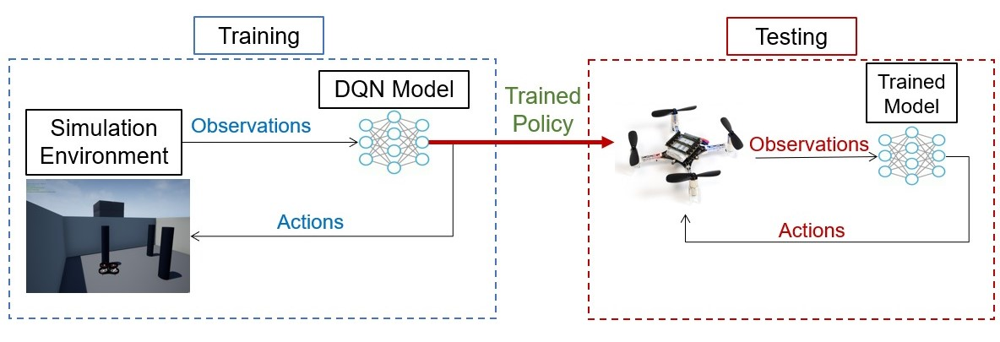
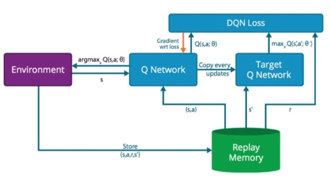

# DRL-Crazyflie
Deep reinforcement learning with bitcraze crazyflie 2.1.



This repository contains the following parts:
  - Training: in the [main_DRL](https://github.com/omritz/DRL-Crazyflie/main_DRL.py) you will find the code for training and evaluate your model.
  - Testing: for testing your trained policy go to [main_DRL](https://github.com/omritz/DRL-Crazyflie/main_crazyflie.py) and choose your model.

## Project details:
In this project we implement a DQN algorithem for goal seeking in nano drone from [Bitcraze](https://www.bitcraze.io).

### This implementation contains:

1. Deep Q-network
2. Experience replay memory
    - To reduce the correlations between consecutive updates
3. Network for Q-learning targets are fixed for intervals
    - To reduce the correlations between target and predicted Q-values
    


# Install
 The following instructions are tested on Windows 10
 
 **Install Unreal engine:**
 - Go to [Unreal](https://www.unrealengine.com/en-US/get-now) and download Unreal engine.
    

**Install AirSim:**
- Install the [Airsim plugin](https://github.com/microsoft/AirSim).
    
**Dependencies**
```bash
pip install airsim tensorflow gym
```
